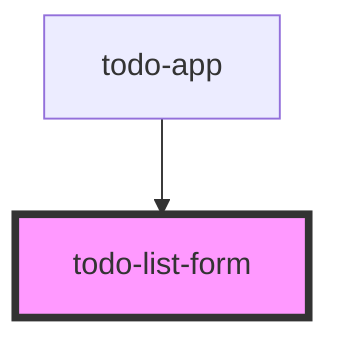

# todo-list-form

<!-- Auto Generated Below -->

## Properties

| Property          | Attribute           | Description | Type     | Default     |
| ----------------- | ------------------- | ----------- | -------- | ----------- |
| `todoItemsLength` | `todo-items-length` |             | `number` | `undefined` |

## Events

| Event         | Description | Type               |
| ------------- | ----------- | ------------------ |
| `inputChange` |             | `CustomEvent<any>` |
| `submit`      |             | `CustomEvent<any>` |

## Dependencies

### Used by

 - [todo-app](../todo-app)

### Graph

----------------------------------------------

*Built with [StencilJS](https://stenciljs.com/)*
