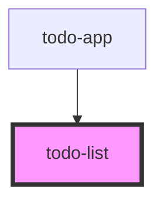

# todo-list

<!-- Auto Generated Below -->

## Properties

| Property    | Attribute | Description | Type         | Default     |
| ----------- | --------- | ----------- | ------------ | ----------- |
| `todoItems` | --        |             | `TodoItem[]` | `undefined` |

## Dependencies

### Used by

 - [todo-app](../todo-app)

### Graph

----------------------------------------------

*Built with [StencilJS](https://stenciljs.com/)*
